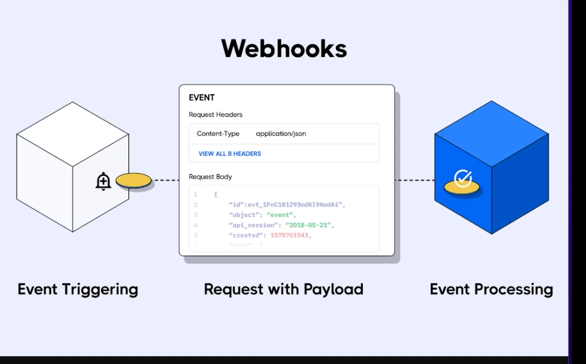
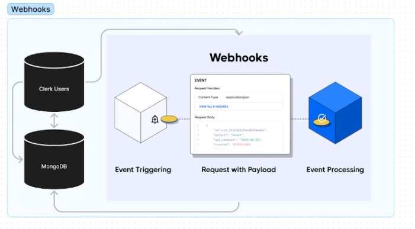

## Using WebHooks to sync the clerk and MongoDB Data

- Hum clerk use kar rahe hai apne user ke authentication k liye but ye baat mongodb ko kaise pata lagegi ki naya user nai signup kiya hai ya user nai apna profile update kiya hai kyoki user nai wo sab to clerk mai kiya hai
- Ishi cheez ko tackle karne k liye we use _`WebHooks`_

_WebHooks kya hai_ - Using the webhooks ek app dusre app se bate kar sakta hai, using webhooks apps hai wo real time pe communicate kar sakti hai using webhook ham ek automated message bhej sakte hai ek app se dusre app ko jab ek particular event occur hua ho



- For Ex - Hame stripe use kar rahe hai for payment reciving in our app, orr ab hum kya cahate hai ki jaise hi user pay kare wo premium content ko access kar sake , uska ek simple ka solution kya ho sakta hai hum stripe pe continously check karte rahe ki koi naya user to nhi bana hai , same in the case of alertify - hum new email k liye ek fixed time k baad ek call kar rahe the . _`Other Solution` - _ Hum stripe ko keh de ki bhai jab bhi nayi payment ho to data yaha bhej diyo.
- iske liye webhook banaya gaya hai, stripe k webhook ka use kar k hum data le sakte hai , orr jo webhook hoga wo ek event pe trigger hoga or ek client endpoint uspe data bhejega
- Hamare case mai hum ishe clerk or MongoDB mai use kar rahe hai

https://clerk.com/docs/users/sync-data#sync-clerk-data-to-your-backend-with-webhooks



---

### Clerk - https://clerk.com/docs/references/nextjs/auth-middleware

---

## Building Community Page

- Build The UI , uske baad server action banao [ Db se connect karo data thao or return karo]
- line-clamp-1

## Dynamic Routing

- For `Dynamic Routing` ek naya page banao [id].tsx (this will only catch till one slash)
- isme use router use karo to get the query string

```
    const route = useRouter();

    console.log(router.query.id);
```

`_ Catching All Segments_ - Name the file _[...slug].tsx_

isme - /question/134,/question/123/123 sare honge par /question nhi honga

/question [means without parameter wale ko use karne k luye optional catch parameter use karo - [ [...slug]].tsx ]
`

## useRouter Hook

- It gives access to route[path] object

_Properties_ -

1. Pathname - path dedega pura
   ```
       router.pathname
   ```
2. query - to access the query string dynamic route parameter or simple route parameter

_Methods_

1. route.push
   ```
       router.push("/about");
   ```
